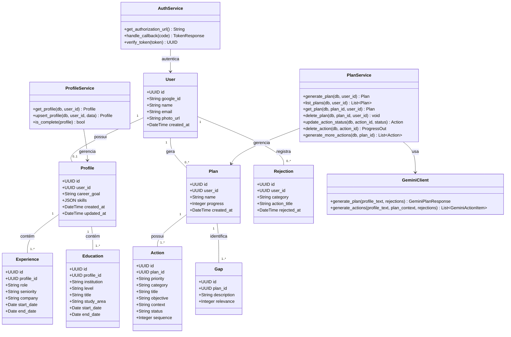
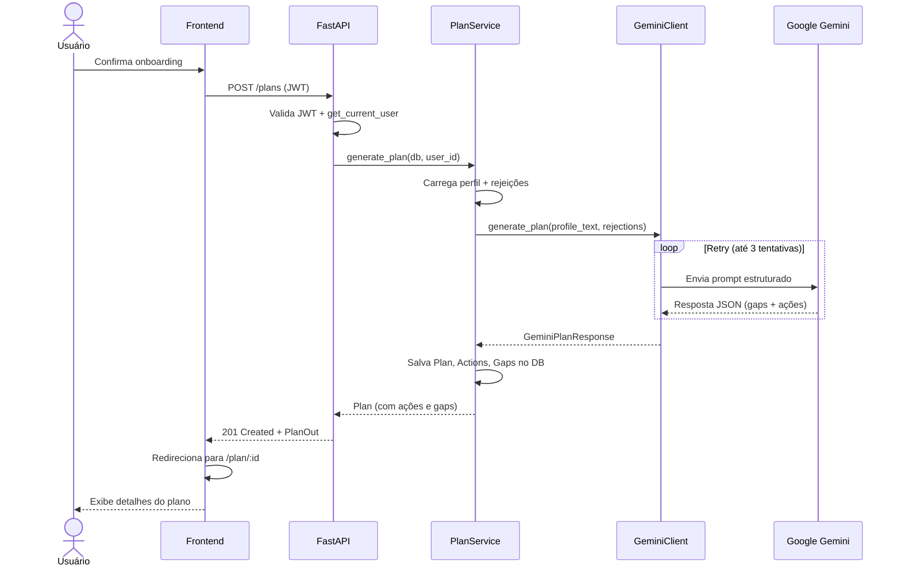
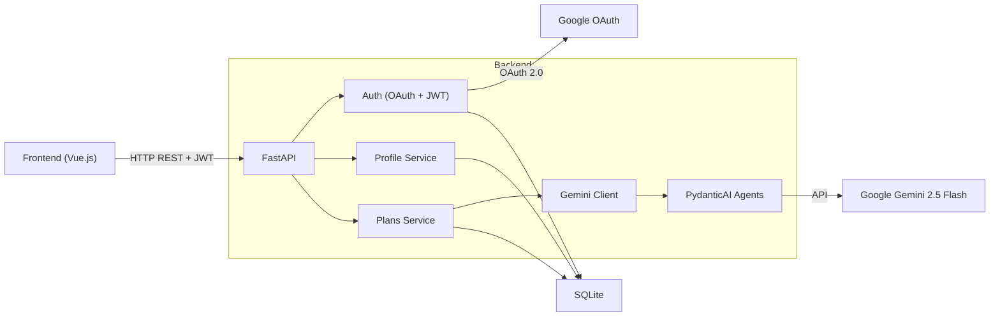

# Arquitetura — MentorIA (Backend)

## Visão Geral

API REST responsável pela lógica de negócio da plataforma MentorIA. Gerencia autenticação via Google OAuth, perfis de usuário, e a geração de planos de desenvolvimento de carreira utilizando agentes de IA (Google Gemini). Persistência em SQLite.

> Arquitetura do frontend: [`frontend/docs/ARCHITECTURE.md`](../../frontend/docs/ARCHITECTURE.md)

---

## Stack

| Tecnologia | Versão | Função |
|---|---|---|
| Python | 3.12 | Linguagem |
| FastAPI | 0.135+ | Framework web async |
| SQLAlchemy | 2.x | ORM |
| Alembic | 1.x | Migrations |
| SQLite | — | Banco de dados (embutido) |
| PydanticAI | 0.x | Agentes de IA com output estruturado |
| Google Gemini | 2.5 Flash | Modelo LLM |
| Pydantic | 2.x | Validação de dados |
| pydantic-settings | 2.x | Configuração via .env |
| python-jose | 3.x | JWT (criação/verificação) |
| authlib | 1.x | OAuth 2.0 client |
| httpx | 0.x | HTTP client async |
| uvicorn | 0.x | ASGI server |

---

## Estrutura de Pastas/Arquivos

```
backend/
├── src/
│   ├── main.py              # App FastAPI, middlewares (CORS, logging), registro de routers
│   ├── config.py            # Settings via pydantic-settings (.env)
│   ├── database.py          # Engine SQLAlchemy + SessionLocal
│   ├── dependencies.py      # get_db, get_current_user
│   ├── auth/
│   │   ├── models.py        # User (UUID, google_id, name, email, photo_url)
│   │   ├── schemas.py       # TokenResponse, UserOut
│   │   ├── service.py       # AuthService (OAuth flow, JWT create/verify)
│   │   └── router.py        # Rotas de autenticação
│   ├── profile/
│   │   ├── models.py        # Profile, Experience, Education
│   │   ├── schemas.py       # ProfileIn/Out, ExperienceIn/Out, EducationIn/Out, enums
│   │   ├── service.py       # ProfileService (get, upsert, is_complete)
│   │   └── router.py        # Rotas de perfil
│   ├── plans/
│   │   ├── models.py        # Plan, Action, Gap, Rejection
│   │   ├── schemas.py       # PlanOut, PlanSummary, ActionOut, GapOut, ProgressOut, enums
│   │   ├── service.py       # PlanService (generate, list, get, delete, actions CRUD)
│   │   └── router.py        # Rotas de planos e ações
│   └── gemini/
│       ├── agents.py        # roadmap_agent, actions_agent (PydanticAI + GoogleProvider)
│       ├── client.py        # GeminiClient (orquestra chamadas aos agentes com timeout)
│       ├── prompts.py       # Templates de prompt (perfil + rejeições)
│       └── schemas.py       # GeminiPlanResponse, GeminiActionItem, GeminiGapItem
├── tests/
│   ├── conftest.py          # Fixtures compartilhadas (db, user, profile, plan, JWT, mocks)
│   └── test_*.py            # Testes por módulo (auth, profile, plans, gemini, dependencies)
├── alembic/                 # Migrations do banco de dados
├── alembic.ini
├── requirements.txt
├── Dockerfile
└── .env.example
```

---

## Endpoints

### Auth (`/auth`)

| Método | Rota | Auth | Descrição |
|---|---|---|---|
| GET | `/auth/google/login` | Não | Redireciona para OAuth do Google |
| GET | `/auth/google/callback` | Não | Callback OAuth → cria/busca user → redireciona frontend com JWT |

### Profile (`/profile`)

| Método | Rota | Auth | Descrição |
|---|---|---|---|
| GET | `/profile` | JWT | Retorna perfil do usuário logado |
| POST | `/profile` | JWT | Cria ou atualiza perfil (upsert) |

### Plans (`/plans`)

| Método | Rota | Auth | Descrição |
|---|---|---|---|
| GET | `/plans` | JWT | Lista planos do usuário |
| POST | `/plans` | JWT | Gera novo plano via Gemini (201) |
| GET | `/plans/{id}` | JWT | Detalhe de um plano |
| DELETE | `/plans/{id}` | JWT | Remove plano (204) |
| PATCH | `/plans/{id}/actions/{action_id}` | JWT | Atualiza status de uma ação |
| DELETE | `/plans/{id}/actions/{action_id}` | JWT | Remove ação (registra rejeição, retorna progresso) |
| POST | `/plans/{id}/actions/generate` | JWT | Gera mais ações via Gemini |

---

## Diagrama UML de Classes



---

## Diagrama de Sequência — Geração de Plano



---

## Diagrama de Conexões


