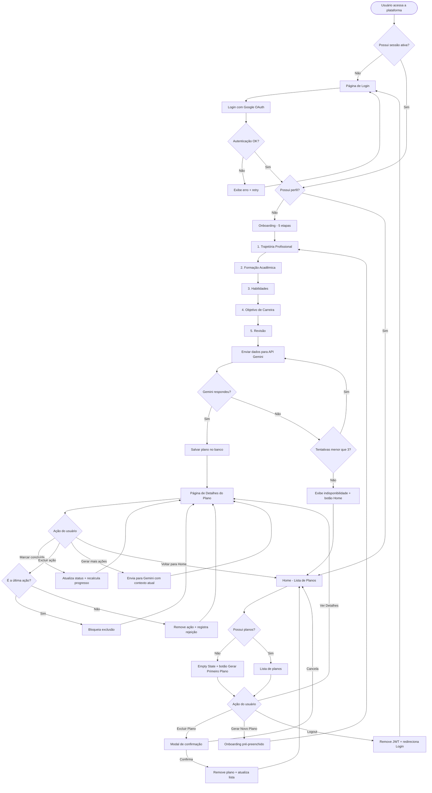

# Fluxograma de Funcionamento — Mentoria.IA

Diagrama que representa o fluxo completo do usuário na plataforma, desde o acesso inicial até a gestão de planos de desenvolvimento.

```mermaid
flowchart TD
    A([Usuário acessa a plataforma]) --> B{Possui sessão ativa?}

    B -- Não --> C[Página de Login]
    B -- Sim --> D{Possui perfil?}

    C --> E[Login com Google OAuth]
    E --> F{Autenticação OK?}
    F -- Não --> G[Exibe erro + retry]
    G --> C
    F -- Sim --> D

    D -- Não --> H[Onboarding - 5 etapas]
    D -- Sim --> I[Home - Lista de Planos]

    H --> H1[1. Trajetória Profissional]
    H1 --> H2[2. Formação Acadêmica]
    H2 --> H3[3. Habilidades]
    H3 --> H4[4. Objetivo de Carreira]
    H4 --> H5[5. Revisão]
    H5 --> J[Enviar dados para API Gemini]

    J --> K{Gemini respondeu?}
    K -- Sim --> L[Salvar plano no banco]
    L --> M[Página de Detalhes do Plano]
    K -- Não --> N{Tentativas menor que 3?}
    N -- Sim --> J
    N -- Não --> O[Exibe indisponibilidade + botão Home]
    O --> I

    I --> P{Possui planos?}
    P -- Não --> Q[Empty State + botão Gerar Primeiro Plano]
    P -- Sim --> R[Lista de planos]

    R --> S{Ação do usuário}
    Q --> S

    S -- Ver Detalhes --> M
    S -- Excluir Plano --> T[Modal de confirmação]
    S -- Gerar Novo Plano --> U[Onboarding pré-preenchido]
    S -- Logout --> V[Remove JWT + redireciona Login]
    V --> C

    T -- Confirma --> W[Remove plano + atualiza lista]
    W --> I
    T -- Cancela --> I

    U --> H1

    M --> X{Ação do usuário}
    X -- Marcar concluída --> Y[Atualiza status + recalcula progresso]
    Y --> M
    X -- Excluir ação --> Z{É a última ação?}
    Z -- Sim --> AA[Bloqueia exclusão]
    AA --> M
    Z -- Não --> AB[Remove ação + registra rejeição]
    AB --> M
    X -- Gerar mais ações --> AC[Envia para Gemini com contexto atual]
    AC --> M
    X -- Voltar para Home --> I
```
